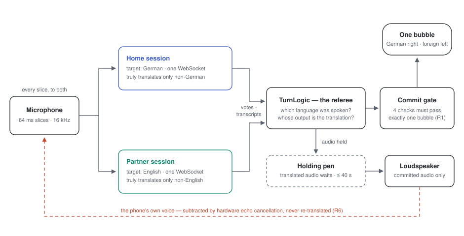

# Heiko Translate

A one-button iPhone app for live speech translation between any two of four
languages: German, English, Korean and Mexican Spanish. The pair is picked in
settings and either language can take either side, so all six pairs are on
offer; within a pair, who just spoke is worked out automatically. Built as a
gift for Heiko. Voice-to-voice translation runs through Google's Gemini Live
API.

Four is a deliberate limit rather than how far the work got. Direction is
inferred rather than known, and that inference only holds up between
languages that are far apart, which is also why French is not here.
`SPEC.md` §3.0 has the reasoning and the conditions for revisiting it.

## What this is

Heiko Translate is also an experiment. I work with engineers every day at
my job; this project tests how far I can get without one, directing AI to
design, build, test, and ship a real iOS app on my own, with no engineer's
judgment anywhere in the loop.

The goal is to get to something good enough to *live with*: for someone
to carry it, use it for a few real days, and have it hold up as a
high-level prototype that almost passes for a shipped application, not a
demo. The invariants in `SPEC.md`, the test levels in `TESTING.md`, and the
release process in `docs/release.md` aren't process for its own sake;
they're the actual experiment. "AI wrote good code" only means something if
it can survive a few real days in someone's pocket.

## How it works

<picture>
  <source media="(prefers-color-scheme: dark)" srcset="docs/machine-dark.svg">
  
</picture>

*Shown for the default German↔English pair; the pair is chosen in settings.*

Google's Live Translate model translates **into** exactly one fixed language
per session (the source language is auto-detected). So the app runs two
sessions concurrently — one per side of the selected language pair — and
streams every 64 ms microphone slice to both. Direction is decided by deeds,
not declarations: a session produces a substantial translation only when the
input was not already its own target language, so whichever session
translated reveals who spoke. The detected-language codes the model streams
are used as a veto and a straggler filter, never as the decision — they are
wrong too often to be trusted directly.

Playing audio is irreversible — it can speak the other person's words in the
wrong voice — so translated audio is held and released only after the turn
commits. The microphone never closes while a translation plays; the iPhone's
hardware echo cancellation keeps the app from re-hearing its own output. The
model does not reliably signal end-of-turn (verified on the wire), so turns
are ended by measured idle timeouts, and watchdogs recover on their own from
dead microphones, expired sessions, and dropped connections.
`docs/ARCHITECTURE.md` holds the details and the device evidence behind each
number.

### Where the preview model stands, in Google's own words

The model is
[`gemini-3.5-live-translate-preview`](https://ai.google.dev/gemini-api/docs/models/gemini-3.5-live-translate-preview):
"Gemini 3.5 Live Translate is our low-latency, audio-to-audio model optimized
for real-time translation of spoken conversations." It is a **Preview**
model, which in [Google's model lifecycle](https://ai.google.dev/gemini-api/docs/models)
means: "Points to a preview model which may be used for production. Preview
models will typically have billing enabled, might come with more restrictive
rate limits and will be deprecated with at least 2 weeks notice."

Google's [live translation guide](https://ai.google.dev/gemini-api/docs/live-api/live-translate)
documents these limitations, all of which this app lives with:

- "Voice replication can be inconsistent. Voices might shift after long
  pauses, assign the wrong gender based on how the speech starts, or get
  stuck on one voice during rapid multi-speaker conversations."
- "Language detection struggles with heavy accents, similar languages
  (e.g., Spanish vs. Portuguese), or rapid language switches."
- "Only audio input is supported for translation. Text input is not
  supported."
- "The model is designed to filter out noise and music to produce clean
  speech, but not all background audio may be ignored."

Beyond the documentation, this project has verified directly against the
live API (`docs/ARCHITECTURE.md`, "Wire protocol"):

- the model does not reliably send `turnComplete`, so turns are resolved by
  idle timeout instead;
- sessions have a bounded duration (~9 minutes observed) and end with
  `goAway`; the app reconnects silently;
- the first ~1 second of an utterance can be misdetected — sometimes
  unanimously by both sessions — which is why the spoken language is settled
  by a voting window rather than first-guess-wins.

A preview API's shapes can also change without much warning, so every server
message the code doesn't recognize is logged rather than silently dropped —
a change is visible in the diagnostic log the day it happens.

## The documents

This file is **setup only**. The other documents each own one thing:

| Document | Owns |
|---|---|
| `SPEC.md` | Product truth — behavior and the R1–R8 invariants |
| `TESTING.md` | Test truth — levels L1–L4 and current status |
| `docs/ARCHITECTURE.md` | Technical truth — sessions, turn logic, wire protocol |
| `docs/history.md` | The original plan (historical; do not build against it) |
| `CLAUDE.md` | Working rules and commands for AI-assisted sessions |

## First-time setup (on your Mac)

1. **Install xcodegen** (generates the `.xcodeproj` from `project.yml`; the
   project file itself is gitignored and regenerated):
   ```
   brew install xcodegen
   ```

2. **Add your Gemini API key:**
   ```
   cp HeikoTranslate/Resources/Secrets.plist.example HeikoTranslate/Resources/Secrets.plist
   ```
   Then edit `Secrets.plist` and paste in a real key from
   [aistudio.google.com](https://aistudio.google.com/apikey). This file is
   gitignored — it will never get committed.

3. **Generate and open the project:**
   ```
   xcodegen generate
   open HeikoTranslate.xcodeproj
   ```
   Re-run `xcodegen generate` whenever `project.yml` changes.

4. **Set your signing team:** in Xcode, select the `HeikoTranslate` target →
   *Signing & Capabilities* → set your team. (A free Apple ID suffices to
   run on your own device; the paid Developer Program is needed for
   TestFlight.)

5. **Run it** on your iPhone (Xcode → select your device → ▶). First launch
   asks for microphone permission — accept it. Echo cancellation and
   speaker/mic behavior are device things; the Simulator is fine for UI and
   connection checks.

6. **If audio stops coming back**, check the Xcode console first: every
   server message the code doesn't recognize is printed as
   `GeminiLive[...] unrecognized message: ...` rather than silently dropped.

## Running the tests

Before any human-with-a-phone testing, L1–L3 must pass (`TESTING.md`):

```
Tools/l1.sh                                                          # L1
Tools/l2probe.sh de "Where is the train station?"                    # L2
Tools/l3replay.sh                                                    # L3
```

## Project layout

```
HeikoTranslate/
  HeikoTranslateApp.swift        App entry point
  ContentView.swift              The single screen (bubbles + one button + status)
  ConversationViewModel.swift    UI state; owns the translation service
  Models/
    TurnLogic.swift              THE turn state machine (pure, L1-tested):
                                 spoken language -> translator -> commit gates
    FillerWords.swift            Hesitation stripping (adversarially reviewed)
  Services/
    GeminiLiveSession.swift            One WebSocket to Gemini Live Translate,
                                       fixed to a single target language
    GeminiLiveTranslationService.swift Runs the two sessions of the selected
                                       language pair concurrently, audio I/O,
                                       turn timers, reconnects
    AppConfig.swift                    Loads the API key from Secrets.plist
  Resources/
    Secrets.plist.example        Template — copy to Secrets.plist, add your key
Tests/                           L1 unit tests (run via xcodebuild test)
Tools/                           l2probe.sh (L2), L3 replay harness
TestAudio/                       Recorded utterances for L3 replay
docs/                            ARCHITECTURE.md, history.md
design/                          Icon sources and design iterations
```
